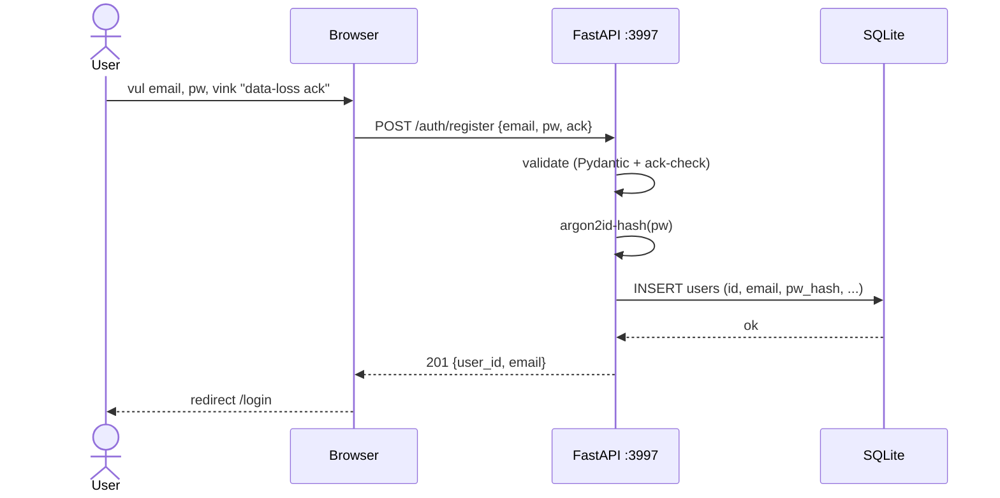
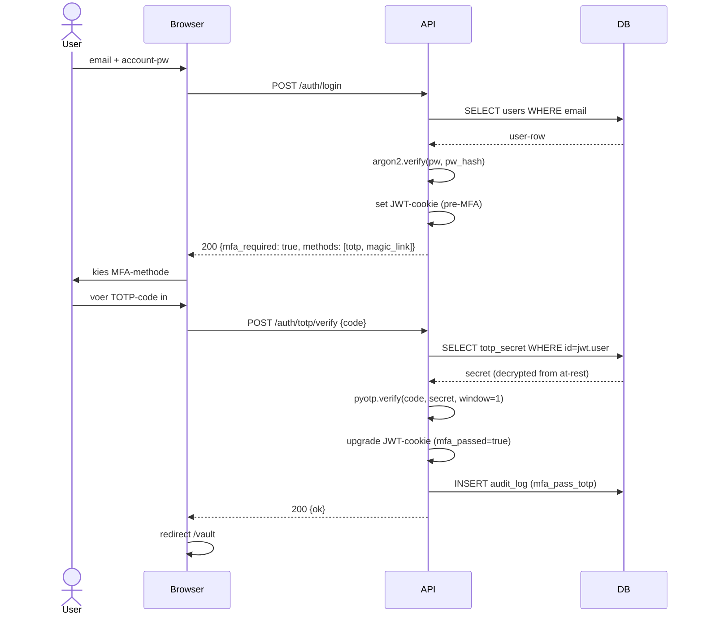
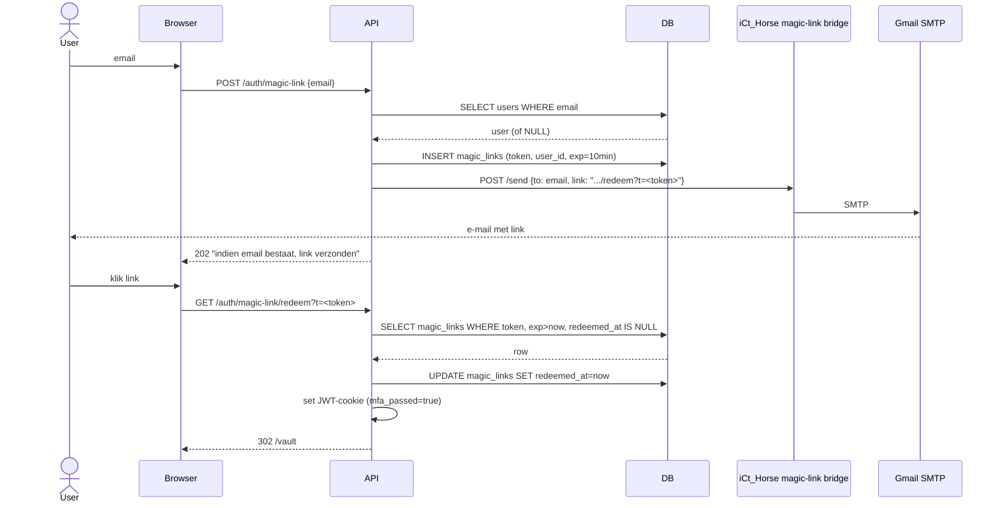
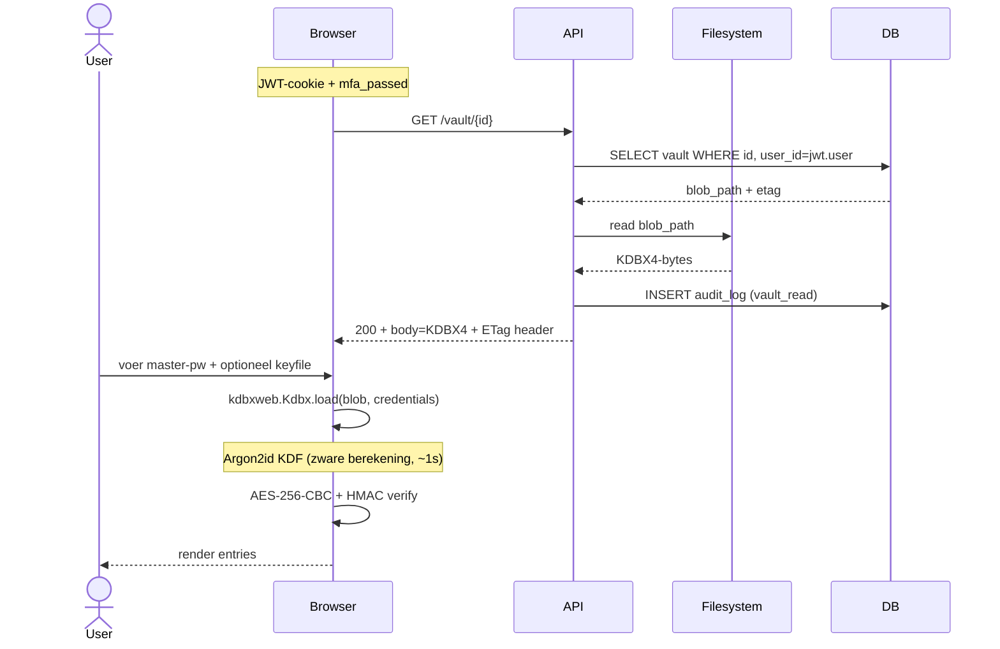
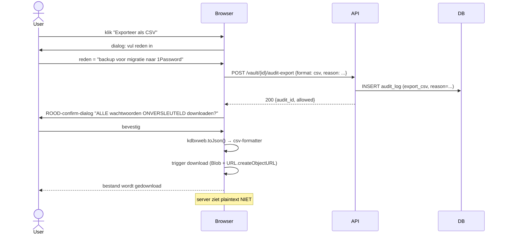

# SEQUENCE_DIAGRAMS.md — HorseSafe

> Mermaid-flows voor belangrijke operaties. Cross-ref: `ARCHITECTURE.md §2.4-2.6`.

## SQ-1 — Account-registratie



## SQ-2 — Login + TOTP



## SQ-3 — Magic-link login



## SQ-4 — Vault-openen (decryptie volledig in browser)



## SQ-5 — Vault-update met optimistic lock

```mermaid
sequenceDiagram
    actor User
    participant Browser
    participant API
    participant FS

    User->>Browser: bewerk entry, klik save
    Browser->>Browser: kdbxweb.save() → nieuwe KDBX4-blob
    Browser->>API: PUT /vault/{id}, If-Match: <oude-etag>, body=blob
    API->>API: bereken huidige server-etag (sha256 van disk-blob)
    alt etag matcht
        API->>FS: write blob (atomic: tmp + rename)
        API->>API: nieuwe etag = sha256(new blob)
        API->>DB: UPDATE vaults SET etag=..., size_bytes=..., updated_at=now
        API->>DB: INSERT audit_log (vault_update)
        API-->>Browser: 200 + nieuwe ETag header
    else etag mismatch
        API-->>Browser: 412 {error: etag_mismatch, current_etag: ...}
        Browser->>User: dialog "vault elders gewijzigd; herlaad of force overwrite"
    end
```

## SQ-6 — Plaintext export (CSV/JSON/XLSX)



## SQ-7 — Clipboard-copy met 10s wipe

```mermaid
sequenceDiagram
    actor User
    participant Browser

    User->>Browser: klik "📋 kopieer pw"
    Browser->>Browser: navigator.clipboard.writeText(pw)
    Browser->>User: visuele 10s aftelling
    Note over Browser: timer pauzeert bij tab-blur
    Browser->>Browser: na 10s: navigator.clipboard.writeText("[HorseSafe wiped]")
    Browser->>User: aftelling klaar
    Note over Browser: best-effort; v0.2 extensie = echte wipe
```
